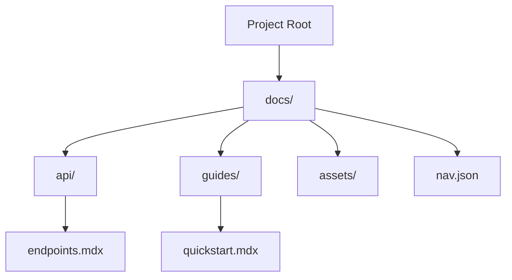

## Overview

Ivan Shevtsov Documentation provides essential tools to organize, structure, and collaborate on your project docs. You create hierarchical spaces for content, manage versions, and enable team workflows. Master these core concepts to build effective documentation.

<Columns cols={3}>
  <Card title="Document Organization" icon="folder" href="#document-organization">
    Structure your content with folders, tags, and search.
  </Card>
  <Card title="Project Structures" icon="git-branch" href="#project-structures">
    Define layouts for single or multi-project docs.
  </Card>
  <Card title="Collaboration Basics" icon="users" href="#collaboration-basics">
    Share, review, and merge changes seamlessly.
  </Card>
</Columns>

## Document Organization

Organize documents using folders and tags to keep content accessible. Create nested folders for topics like `api/`, `guides/`, and `reference/`. Add tags such as `v1.0`, `beta`, or `internal` for filtering.

<Callout kind="tip">
  Use consistent naming conventions like `kebab-case` for folders to improve navigation.
</Callout>

<Tabs>
  <Tab title="Folder-Based" icon="folder">
    Group related MDX files in directories.

    ```
    docs/
    ├── api/
    │   └── endpoints.mdx
    └── guides/
        └── quickstart.mdx
    ```
  </Tab>
  <Tab title="Tag-Based" icon="tag">
    Apply metadata tags in frontmatter.

    ```yaml
    ---
    title: Endpoint Guide
    tags: ["api", "v2.0"]
    ---
    ```
  </Tab>
</Tabs>

## Project Structures

Define project structures to scale documentation across repositories or versions. A typical structure includes a root `docs/` folder with MDX files, navigation configs, and assets.



<CodeGroup tabs="Single Project,Multi-Project">
  ```json
  {
    "docs": {
      "api": ["endpoints.mdx"],
      "guides": ["setup.mdx"]
    }
  }
  ```
  ```json
  {
    "projects": {
      "v1": { "path": "docs-v1/" },
      "v2": { "path": "docs-v2/" }
    }
  }
  ```
</CodeGroup>

## Collaboration Basics

Set up collaboration by inviting team members and defining roles. You review changes via previews and merge via pull requests.

<Steps>
  <Step title="Invite Collaborators" icon="user-plus">
    Go to project settings and add emails.
  </Step>
  <Step title="Assign Roles" icon="shield">
    Choose viewer, editor, or admin permissions.
  </Step>
  <Step title="Review Changes" icon="eye">
    Preview edits before publishing.
  </Step>
</Steps>

| Role       | View | Edit | Publish | Admin |
|------------|------|------|---------|-------|
| Viewer     | ✅   | ❌   | ❌      | ❌    |
| Editor     | ✅   | ✅   | ❌      | ❌    |
| Admin      | ✅   | ✅   | ✅      | ✅    |

<ExpandableGroup>
  <Expandable title="Advanced Permissions" default-open="false">
    Customize access with granular controls like branch protection.
  </Expandable>
</ExpandableGroup>

These concepts form the foundation. Explore features next with practical guides.